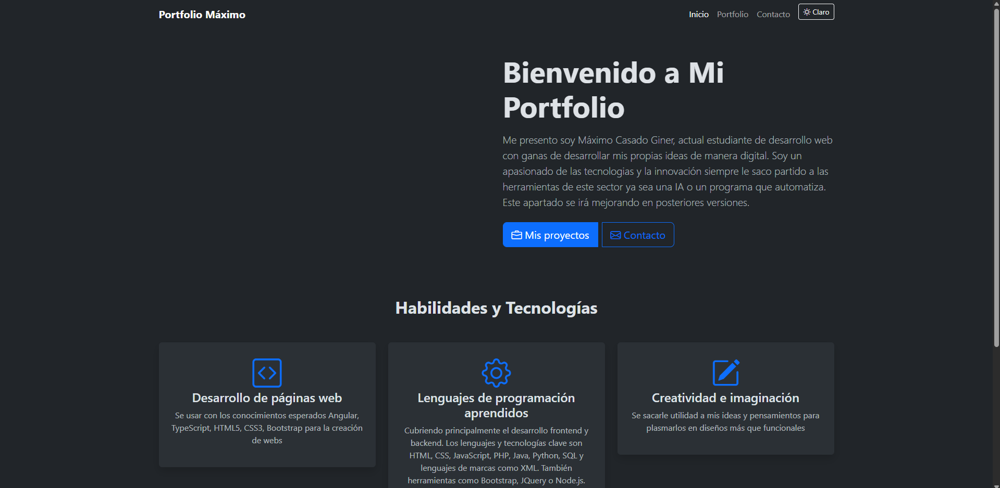
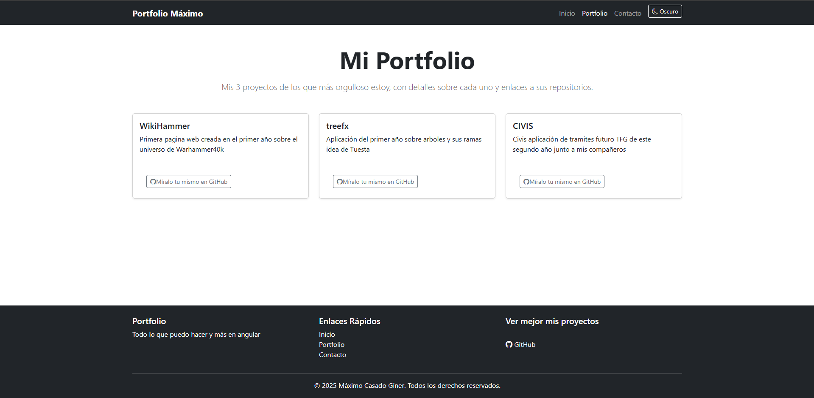
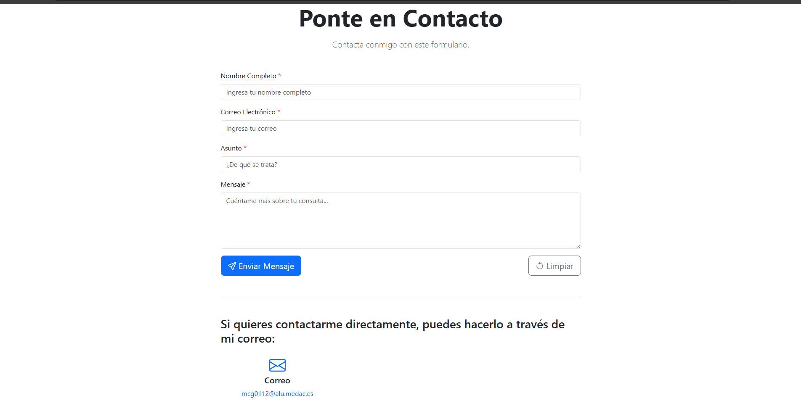

# 🌟 Portfolio Profesional - Máximo Casado Giner

Este proyecto es un portfolio profesional desarrollado con **Angular** y **Bootstrap 5**, diseñado bajo una estética de "Warm Creative Studio". Ofrece una experiencia de usuario fluida, reactiva y personalizada, cumpliendo con los más altos estándares técnicos y académicos.

---

## 🚀 Características Principales

- **Diseño Premium**: Paleta de colores cálida (Naranja Coral y Crema), tipografía curada (Playfair Display y Nunito) y animaciones fluidas.
- **Arquitectura Standalone**: Todos los componentes son independientes, facilitando el mantenimiento y la escalabilidad.
- **Gestión de Estado con Signals**: Uso de Angular Signals para una reactividad eficiente en el tema, visibilidad de elementos y formularios.
- **Persistencia de Datos**: Los ajustes de usuario (como el modo claro/oscuro) se guardan automáticamente en `localStorage`.
- **Formulario Reactivo**: Validación robusta en tiempo real para una comunicación directa y efectiva.
- **Huevo de Pascua (Secret Achievement)**: Implementación del legendario **Código Konami** con un overlay secreto de diseño exclusivo.

---

## 🛠️ Tecnologías y Herramientas

- **Angular (Signals & Standalone)**: Framework principal para la lógica y estructura.
- **Bootstrap 5**: Integrado para una base responsive y de alta velocidad.
- **TypeScript Avanzado**: Tipado fuerte, interfaces personalizadas y enums para una lógica de negocio robusta.
- **SCSS/CSS3**: Estilos personalizados con efectos de **Glassmorphism**, gradientes animados y layouts dinámicos.

---

## 📖 Detalles Técnicos

### 1. Estructura de Componentes y Rutas
La aplicación se divide en módulos funcionales:
- **Home**: Presentación principal y habilidades.
- **Portfolio**: Galería de proyectos filtrable/mapeable mediante un componente reutilizable `ProjectCard`.
- **Contact**: Formulario con validaciones avanzadas.
- **Servicios Centralizados**: `ThemeService`, `StorageService` y `ContactService` para desacoplar la lógica de los componentes.

### 2. TypeScript de Nivel Académico
Para garantizar un código limpio y seguro, se han implementado:
- **Interfaces**: `Project`, `ContactForm`, `UserPreferences` y `Theme`.
- **Enums**: `Theme` (Light/Dark) y `ContactSubject` (para tipificar los motivos de contacto).
- **Manejo de Errores**: Uso sistemático de bloques `try/catch` en operaciones críticas de almacenamiento.

### 3. Interatividad con Pipes
Uso de pipes nativos como `uppercase` para el formateo dinámico de datos en las plantillas, asegurando una presentación coherente.

---

## 📸 Galería de Capturas

Instrucciones: Añade aquí tus capturas del proyecto una vez desplegado.
- [ ] 
- [ ] 
- [ ] 

---

## 📂 Cómo Ejecutar el Proyecto

1. **Clonar el repositorio**:
   ```bash
   git clone https://github.com/Max656plin/MaximoPortfolioAngular.git
   ```
2. **Instalar dependencias**:
   ```bash
   npm install
   ```
3. **Lanzar el servidor de desarrollo**:
   ```bash
   npm start
   ```
4. **Abrir en el navegador**: `http://localhost:4200`
